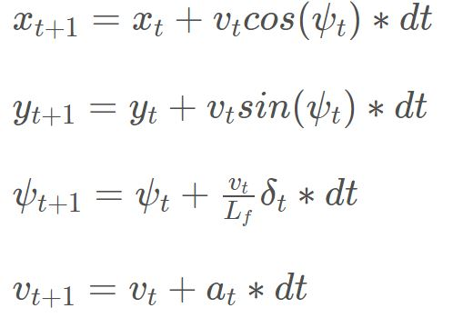
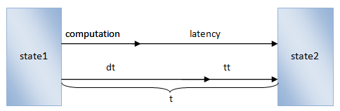

# CarND-MPC-Control

! imag

## **1.Compilation**
The code compiled without errors. The result is in "[build](./build)" folder.
## **2.Implementation**
**2.1 The Model**

I used the model just as the teacher used in class.   
The car's state: [x, y, ψ, v]   
Actuators: [δ, α]   
Update equations:   


**2.2 Timestep Length and Elapsed Duration**

First I set the prediction horizon about 2 or 3 seconds.

Second, I set the dt.

As shown in below. The duration (dt) should larger than t (computation plus latency), otherwise the duration 'tt' is not predicted. That's means we don't know what happend in tt section, witch is not safe.
   
We also know that dt should be as small as possible.
So I set `dt = computation + latency`, but I don't know the computation. To get the computation I add some code in the `main.cpp` to get the time between two `ws.send`. The code is shown in below :
``` c++
auto start = chrono::system_clock::now();
h.onMessage([&mpc,&start](uWS::WebSocket<uWS::SERVER> ws, char *data, size_t length,uWS::OpCode opCode) {

    // bla bla bla .....
    auto end = chrono::system_clock::now();
    auto dur = chrono::duration_cast<chrono::milliseconds>(end - start);
    std::cout<<"computation time: "<< dur.count() <<"  ms"<<std::endl;
    start = end;
}
```
As we know if the `N` is large the `computation + latency` is also large. So `dt` now is related to `N`.

So I just tried some combination.
Finally I set `N`=20 `dt`=0.15.


**2.3 Polynomial Fitting and MPC Preprocessing**

Considering the latency, I need the car's future state(when the car get my command), witch I can predict by the kinematic model, to be my initial state for the MPC.

So I convert the car's current state to be a future state. Then I use this future state as initial state.

Then I convert the waypoints and car state to car's coordinate.

After converting the coordinate, I use the `polyfit()` function to get the coefficients of the waypoints.


**2.4 Model Predictive Control with Latency**

As mentioned in 2.3.

## **3.Something Else**
**Reference speed：**
I think the reference speed should not just be a constant number. The reference speed should be small when the curvature is large. I think the speed have some relation with the curvature.    
In this project I just used two speed. If the curvature is large I use the low speed, if the curvature is small I use the high speed.   

The code below shown how I switch the speed:(located in `MPC.cpp` line 137-155)
```c++
double max_kappa = 0;
  for(int front_dis = 0; front_dis<60;front_dis++){
    // calculate curvature: abs(ddy)/(1+dy^2)^3/2
    double kappa = abs((2*coeffs[2]+6*coeffs[3]*front_dis))/
        pow(1 + pow(coeffs[1]+2*coeffs[2]*front_dis+3*coeffs[3]*front_dis*front_dis, 2), 3.0/2);
    if(kappa>max_kappa)
    {max_kappa = kappa;}
  }
  if(max_kappa>=0.02){ref_v = 60*0.44704;}
  else{ref_v = 90*0.44704;}
```


## **4.Simulation**
The video of my simulation is located in `./video/out.mp4`.(Please ignore the watermark in the video, I used a free software to record my screen so you know that.)
